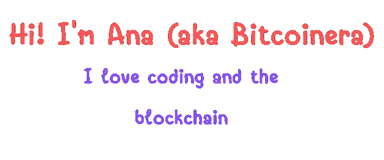

    <kbd>
        
    </kbd>
    <kbd>
        
    </kbd>
    <kbd>
        
    </kbd>

 

I'm a self-taught passionate Full-Stack developer from Spain 🇪🇸 

**About me**

- 👩 Software engineer with over 2 years of experience coding in the Blockchain industry. Currently searching for new challenges (i.e. job).

- 💼 Searching... 😁

- 🌱 I’m currently learning Solidity, Next.js and deepening my knowledge of React

- ❤ I love Vue, React and NodeJS. I also love Bitcoin, Ethereum and the incredible world of Blockchain

- 👯 I’m looking to collaborate on any blockchain project I find challenging and disrupting for the industry. And fun 🙌

 

<code></code>
<code></code>
<code></code>
<code></code>
<code></code>
<code></code>
<code></code> 
<code></code>
<code></code>
<code></code>
<code></code>
 

  

